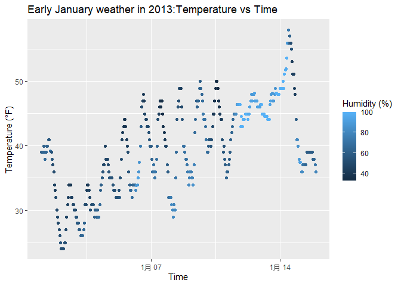

P8105_hw1_yw4667
================
2025-09-13

# Problem 1

## Short Description of the Dataset

The `early_january_weather` dataset contains weather data from EWR
airport for early January 2013.

The variables in this dataset are: origin, year, month, day, hour, temp,
dewp, humid, wind_dir, wind_speed, wind_gust, precip, pressure, visib,
time_hour.

Important variables are as below:

`time_hour`: date and time of each observation

`temp`: temperature in degrees Fahrenheit

`humid`: relative humidity as a percentage

`dewp`: dewpoint temperature(in degrees of Fahrenheit)

`wind_speed`: wind speed in miles per hour

`origin`: weather station identifier

The size of the dataset is 358 rows and 15 columns.

The mean temperature is 39.58 degrees Fahrenheit.

## Scatterplot of Temperature vs Time_Hour

``` r
ggplot(early_january_weather, aes(x = time_hour, y = temp, color = humid)) +
  geom_point() +
   labs(
    title = "Early January weather in 2013:Temperature vs Time",
    x = "Time",
    y = "Temperature (°F)",
    color = "Humidity (%)"
  )
```

<!-- -->

## Description of Patterns

Several patterns of this scatter plot are as below:

1.  **Daily temperature cycles**: There are clear daily fluctuations in
    temperature, with cooler temperatures occurring during the night and
    warmer temperatures during the day.

2.  **Overall warming trend**: There appears to be a gradual increase in
    temperatures over the time period shown.

3.  **Humidity patterns**: Higher humidity levels (lighter colored dots)
    tend to occur with moderate temperatures, while extreme temperatures
    often correspond to lower humidity levels(darker colored dots).

## Export the scatterplot

``` r
ggsave("temp_vs_time_scatterplot.png")
```

    ## Saving 7 x 5 in image

# Problem 2

## Create the data frame with different variable types

``` r
set.seed(1234)
df <- data.frame(
  numeric_var = rnorm(10, mean = 0, sd = 1),
  logical_var = rnorm(10, mean = 0, sd = 1) > 0,
  character_var = letters[1:10],
  factor_var = factor(rep(c("Low", "Medium", "High"), length.out = 10))
  )
```

## Using pull function and try to calculate mean

``` r
df %>% pull(numeric_var) %>% mean()
```

    ## [1] -0.3831574

``` r
df %>% pull(logical_var) %>% mean()
```

    ## [1] 0.3

``` r
df %>% pull(character_var) %>% mean()
```

    ## Warning in mean.default(.): argument is not numeric or logical: returning NA

    ## [1] NA

``` r
df %>% pull(factor_var) %>% mean()
```

    ## Warning in mean.default(.): argument is not numeric or logical: returning NA

    ## [1] NA

## Convert logical/character/factor variables to numeric and calculate mean

``` r
as.numeric(df$logical_var)
as.numeric(df$character_var)  
as.numeric(df$factor_var)
mean(as.numeric(df$logical_var))
mean(as.numeric(df$character_var))
mean(as.numeric(df$factor_var))
```
